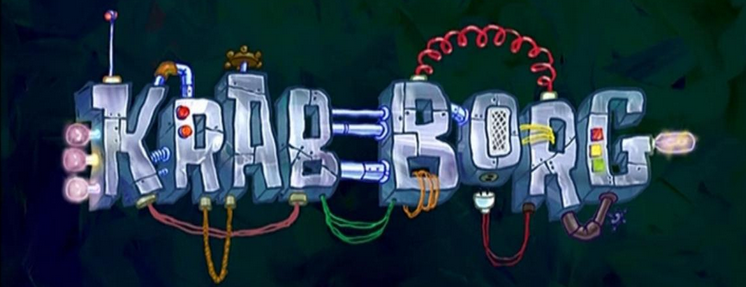

# Discord-Bot
Welcome to the Krab Borg repository. Krab borg is a discord bot written in python. The main goal for Krab Borg is to add extra functionality to
Discord's client. 

If you have any questions or special requests for contribution, please message me on my github.


## Working Commands
```
General:
  !help        Shows list of commands.
  !uptime      Uptime for Krab Borg.
  !mood        Krab Borg's current mood.
  !rules       Displays server rules.
  !invite      Permanent invite link.
  !del         Deletes a fixed amount of messages.
  
Music:
  !resume      Resumes the currently played song.
  !play        Plays a song.
  !volume      Sets the volume of the currently playing song.
  !playing     Shows info about the currently played song.
  !join        Joins a voice channel.
  !summon      Summons the bot to join your voice channel.
  !skip        Vote to skip a song.
  !stop        Stops playing audio and leaves the voice channel.
```

## Future Commands
For the future, I am planning on adding the following features to Krab Borg:
```
1. Ability to message people privately
2. Ability to fastforward in 30 sec intervals when playing YouTube videos.
3. Change commands so they are role-specific
4. Built-in calculator
5. Ability to set reminders
```

## Credits
https://github.com/XNBlank/sudoBot [for time formatter]
